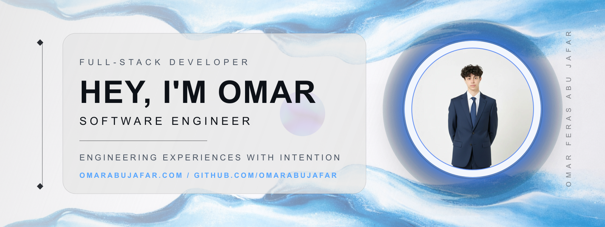
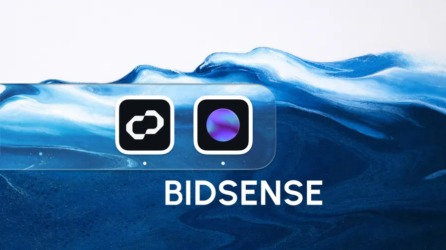
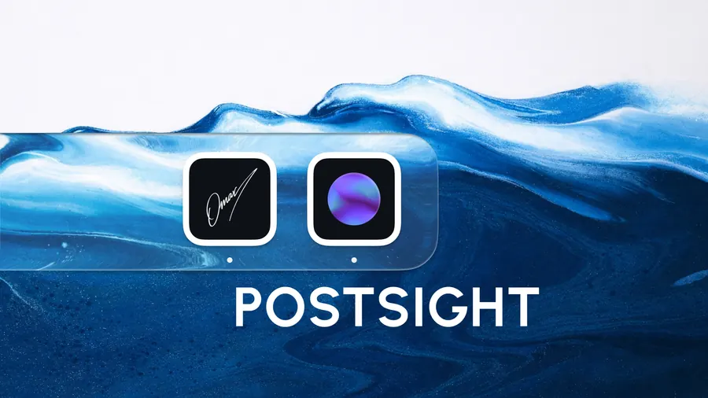
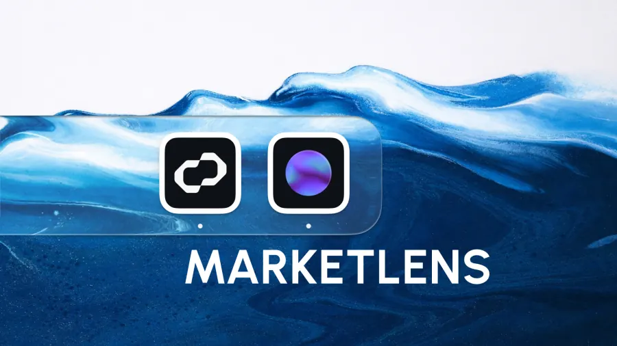

  <picture>
    <source media="(prefers-color-scheme: dark)" srcset="assets/readme/hero-dark.png">
    
  </picture>

  <a href="https://omarabujafar.com">Website</a>
  &nbsp;/&nbsp;
  <a href="https://omarabujafar.com/projects">Projects</a>
  &nbsp;/&nbsp;
  <a href="https://omarabujafar.com/resume">Resume</a>
  &nbsp;/&nbsp;
  <a href="https://omarabujafar.com/blog">Blog</a>
  &nbsp;/&nbsp;
  <a href="https://www.linkedin.com/in/omar-abu-jafar">LinkedIn</a>
  &nbsp;/&nbsp;
  <a href="mailto:omarabujafar@proton.me">Email</a>

  <strong>FULL-STACK SOFTWARE SYSTEMS / BACKEND SERVICES / OPTIMIZATION-DRIVEN APPLICATIONS</strong>

I build software with the same standard I want from tools I use myself: clear interfaces, reliable systems, strict data handling, and enough polish that the experience feels intentional. My work sits mostly around full-stack products, backend logic, developer tools, and optimization workflows where correctness matters.

<table>
  <tr>
    <td align="center"><strong>$10.2M</strong> annual savings identified</td>
    <td align="center"><strong>99.9%</strong> computation time reduction</td>
    <td align="center"><strong>30%</strong> device downtime reduction</td>
    <td align="center"><strong>Full-stack</strong> product, backend, and systems work</td>
  </tr>
</table>

## Selected Work

<table>
  <tr>
    <td width="50%" valign="top">
      
      <h3>BidSense</h3>
      
Enterprise bid evaluation platform for Mubadala Energy that uses MILP optimization to produce guaranteed lowest-cost award allocations and automated Excel reporting.

      
<code>Python</code> <code>PuLP</code> <code>CBC Solver</code> <code>Pandas</code> <code>OpenPyXL</code> <code>TypeScript</code>

    </td>
    <td width="50%" valign="top">
      
      <h3>PostSight</h3>
      
Developer tool that converts PostgreSQL databases and SQL DDL files into clear ERD diagrams so schemas stay understandable and shareable.

      
<code>Next.js</code> <code>TypeScript</code> <code>PostgreSQL</code> <code>Node.js</code> <code>Drizzle ORM</code> <code>React Flow</code>

    </td>
  </tr>
  <tr>
    <td width="50%" valign="top">
      
      <h3>MarketLens</h3>
      
Desktop application for daily energy market intelligence, combining newsletter generation, human approval, and Microsoft Outlook dispatch.

      
<code>Tauri v2</code> <code>React</code> <code>TypeScript</code> <code>Rust</code> <code>Tailwind CSS</code> <code>Azure</code>

    </td>
    <td width="50%" valign="top">
      
      <h3>Personal Portfolio</h3>
      
A designed and engineered space for my work, writing, projects, command palette, and Omi, an AI assistant for questions about my background.

      
<code>Next.js</code> <code>TypeScript</code> <code>OpenAI API</code> <code>Pinecone</code> <code>Framer Motion</code> <code>Vercel</code>

    </td>
  </tr>
</table>

## Stack

  <code>TypeScript</code>
  <code>JavaScript</code>
  <code>Python</code>
  <code>Java</code>
  <code>C#</code>
  <code>C++</code>
  <code>React</code>
  <code>Next.js</code>
  <code>Node.js</code>
  <code>REST APIs</code>
  <code>PostgreSQL</code>
  <code>Docker</code>
  <code>Git</code>
  <code>Optimization</code>

## Focus

- Building full-stack applications with clean architecture and polished interaction details.
- Designing backend services with strict validation, predictable data flow, and maintainable boundaries.
- Applying optimization techniques to real operational workflows, especially where better decisions create measurable business impact.
- Continuing to grow through internships, freelance work, and collaborations with real-world constraints.

## Connect

I am open to internships, freelance projects, and meaningful collaborations.

  <a href="mailto:omarabujafar@proton.me">omarabujafar@proton.me</a>
  &nbsp;/&nbsp;
  <a href="https://github.com/omarabujafar">GitHub</a>
  &nbsp;/&nbsp;
  <a href="https://www.linkedin.com/in/omar-abu-jafar">LinkedIn</a>
  &nbsp;/&nbsp;
  <a href="https://www.instagram.com/omarabujafar_">Instagram</a>

